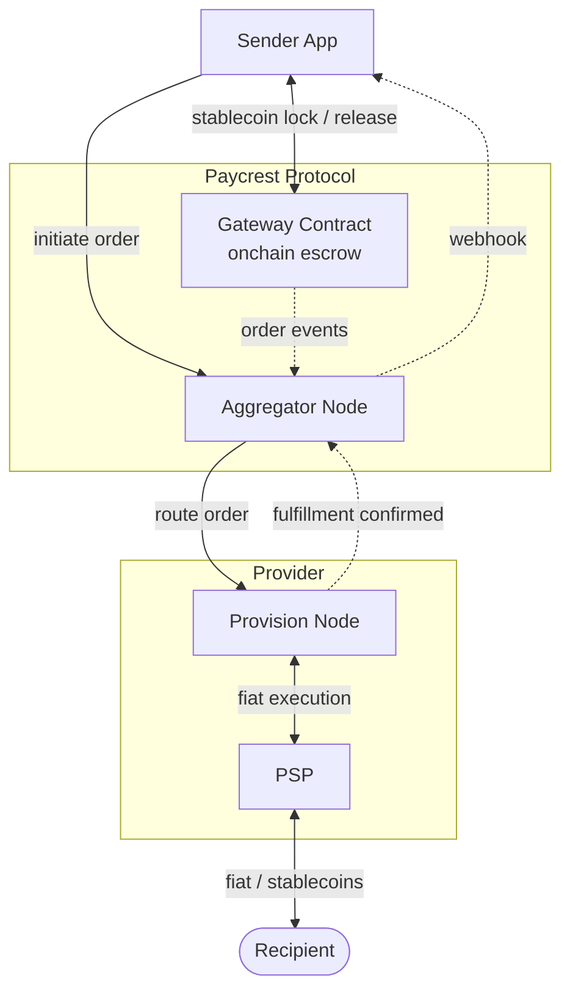

Paycrest is a payment routing protocol built on three cooperating layers: a Gateway smart contract for onchain escrow, an aggregator for order routing and coordination, and provision nodes for fiat execution. This page explains how those components interact.

## Core Components

### Gateway Contract

The **Gateway contract** is the onchain entry point for all payment orders. It holds stablecoins in escrow during the settlement process — neither Paycrest nor any provider ever custodies the funds directly.

#### Key Functions

- **Order Creation**: Accepts payment orders from senders; locks stablecoins in escrow (offramp) or coordinates stablecoin release to recipients (onramp)
- **Event Emission**: Emits events that the aggregator monitors to begin routing
- **Escrow Settlement**: Releases escrowed funds to providers after fulfillment is verified, or returns them to senders if the order can't be completed

#### Payment Flow

<Steps>
  <Step title="Order Creation">
    Sender creates an order via the Sender API or direct contract interaction. For offramp, stablecoins are locked in escrow. For onramp, the contract coordinates stablecoin release once fiat receipt is confirmed.
  </Step>
  <Step title="Routing">
    Aggregator picks up the onchain event and routes the order to the most suitable liquidity provider based on rate, availability, and corridor.
  </Step>
  <Step title="Fulfillment">
    For offramp, the provider disburses fiat to the recipient via a local PSP. For onramp, the provider receives the user's fiat deposit and reports confirmation.
  </Step>
  <Step title="Completion">
    After fulfillment is verified, the contract settles atomically: escrowed stablecoins are released to the provider (offramp), or stablecoins are transferred to the recipient's wallet (onramp). If fulfillment fails, funds are automatically returned.
  </Step>
</Steps>

### Aggregator Node

The **aggregator node** is the coordination layer: it monitors onchain events, manages provider routing, and oversees the settlement pipeline.

#### Core Functions

- **Order Monitoring**: Watches the Gateway contract for new orders
- **Provider Matching**: Routes orders to the optimal provider based on rate and availability
- **Settlement Coordination**: Manages the fulfillment → validation → settlement flow
- **Webhook Delivery**: Notifies senders of order status changes

<Note>
  Paycrest currently operates the **sole aggregator** in the network (federated model). All order matching and coordination fees flow to Paycrest. The protocol is designed to support multiple independent aggregators in a future phase. See the [Decentralization Path](/introduction#decentralization-path).
</Note>

#### API Layers

<CardGroup cols={2}>
  <Card title="Blockchain Layer">
    - Gateway contract event monitoring
    - Transaction submission and confirmation
    - Multi-chain support
  </Card>
  <Card title="Business Logic Layer">
    - Order matching and provider selection
    - Rate validation and optimization
    - Refund and timeout handling
  </Card>
  <Card title="API Layer">
    - REST API (v1 and v2 sender/provider endpoints)
    - Webhook delivery to senders
    - Rate limiting and authentication
  </Card>
  <Card title="Data Layer">
    - Order state management
    - Provider registry and availability
    - Transaction logs and audit trail
  </Card>
</CardGroup>

### Provision Nodes

**Provision nodes** handle fiat execution: disbursing fiat to recipients for offramp orders, or receiving and confirming fiat deposits for onramp orders. They are run by independent liquidity providers who connect their own PSP integrations.

#### Components

- **PSP Integration**: Connects to local payment service providers (banks, mobile wallets)
- **Rate Management**: Sets and updates competitive rates per corridor
- **Order Processing**: Executes assigned payment orders
- **Settlement Reporting**: Reports fulfillment status back to the aggregator

#### Integration Types

<CardGroup cols={2}>
  <Card title="Bank APIs">
    - Direct bank integrations
    - Real-time payment rails
    - Batch processing
  </Card>
  <Card title="Mobile Money">
    - M-Pesa, Airtel Money, MTN Mobile Money
    - PIX (Brazil)
    - Other mobile wallets
  </Card>
</CardGroup>

#### Deployment Options

**Self-Hosted Deployment**
- Complete control over infrastructure and PSP connections
- Requires technical expertise for setup and maintenance
- Recommended for providers with existing PSP relationships

**Managed Deployment via Blockops**
- One-click deployment through [Blockops](https://blockops.network/)
- Automated scaling and monitoring
- Recommended for providers new to infrastructure management

## Multi-Chain Support

The protocol is live on 8 EVM-compatible networks:

| Network | Chain ID | Primary Use |
|---------|----------|-------------|
| Ethereum | 1 | USDT, USDC, cNGN |
| Base | 8453 | USDT, USDC, cNGN |
| Arbitrum One | 42161 | USDT, USDC |
| Polygon | 137 | USDT, USDC, cNGN |
| BNB Smart Chain | 56 | USDT, USDC, cNGN |
| Lisk | 1135 | USDT, USDC |
| Celo | 42220 | USDT, USDC |
| Scroll | 534352 | USDT, USDC |

See [Gateway Contract Addresses](/resources/gateway-contract-addresses) for the full deployment table, and [Supported Stablecoins](/resources/supported-stablecoins) for per-network token details.

## Security Architecture

### Smart Contract Security

The Gateway contract implements multiple security measures:

- **Non-custodial escrow**: Funds are locked onchain, not held by Paycrest or providers
- **Automatic refunds**: Orders not fulfilled within 5 minutes trigger automatic fund return
- **Access control**: Role-based permissions and multi-signature governance for protocol changes
- **Audited contracts**: Gateway contracts are security-audited; see the [contracts repository](https://github.com/paycrest/contracts)

### Data Protection

- **Encrypted recipient data**: Recipient bank details are encrypted in transit and at rest
- **API key authentication**: All API requests authenticated via API Key + API Secret
- **Webhook signature verification**: HMAC-SHA256 signatures on all webhook payloads

## Integration Paths

Senders have two integration options:

<CardGroup cols={2}>
  <Card title="Sender API" href="/implementation-guides/sender-api-integration" icon="code">
    REST API integration — fastest time to integration. Paycrest handles the onchain interaction on your behalf.
  </Card>
  <Card title="Smart Contract" href="/implementation-guides/smart-contract-interaction" icon="file-contract">
    Direct Gateway contract integration — full onchain composability. Automated flows like yield-to-fiat and liquidation-to-bank work natively.
  </Card>
</CardGroup>
