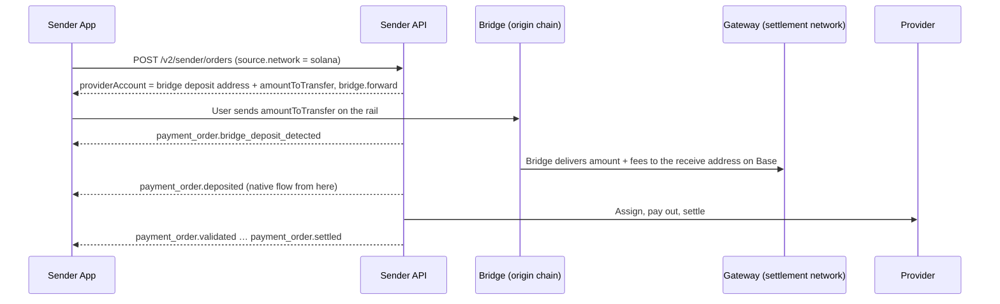

Paycrest settles orders on the networks where its Gateway contract runs (Base, Polygon, Arbitrum, BNB Smart Chain, …). A **bridge rail** is a network Paycrest does not settle on but still accepts in `source.network` (and, later, `destination.network`): the order itself lives on a native **settlement network**, and a cross-chain intent provider carries funds between the rail and the settlement network. Assignment, payout and settlement are exactly the native flow.

Rails are discovered from `GET /v2/tokens`, described on the order by a `bridge` object, and tracked with two extra webhook events. None of that is specific to a direction: the same fields describe an off-ramp deposit on a rail and, when available, an on-ramp payout to one. Which networks are rails, and for which tokens, is whatever `GET /v2/tokens` reports.

## Which networks are rails

`GET /v2/tokens` marks a rail with one extra field, `settlementNetwork`; its presence is what tells you the row is a rail, and its value is where an order funded here settles and is priced. A token without it is a native network. Rails are per **token**, not per network: the same origin network can carry one symbol to one settlement network and another symbol to a different one, because a bridge does not route every symbol to every chain. Always read `settlementNetwork` from the token row you are about to use. The examples on this page use the Solana USDC rail settling on Base.

```json
{
  "symbol": "USDC",
  "network": "solana",
  "contractAddress": "EPjFWdd5AufqSSqeM2qN1xzybapC8G4wEGGkZwyTDt1v",
  "decimals": 6,
  "settlementNetwork": "base"
}
```

Which bridge carries the funds is deliberately not published on a token row: you cannot choose it or route around it, and it can change. A bridged **order** names its carrier on `bridge.provider`, which is where to read it — for a support conversation, or to tell your own users who moves their funds.

A rail can be switched off operationally. When it is, the token is listed without `settlementNetwork` and a create with that `network` is rejected exactly as before the rail existed. A symbol that is not configured on an otherwise live rail is refused with `400` `Source` — "Provided token or payment rail is not supported".

## Off-ramp on a rail

The user deposits on the rail; the bridge delivers the settlement-network amount to the order's receive address, and the native off-ramp flow takes over from there.



### Create the order

Use the normal off-ramp payload with the **origin chain** in `source.network` and a **refund address on that chain**:

```json
{
  "amount": "100",
  "source": {
    "type": "crypto",
    "currency": "USDC",
    "network": "solana",
    "refundAddress": "4Nd1mBQtrMJVYVfKf2PJy9NZUZdTAsp7D4xWLs4gDB4T"
  },
  "destination": {
    "type": "fiat",
    "currency": "NGN",
    "recipient": {
      "institution": "GTBINGLA",
      "accountIdentifier": "1234567890",
      "accountName": "John Doe",
      "memo": "Payment"
    }
  }
}
```

`amount`, `rate`, `senderFee`, provider pinning and everything else behave as on a native network. `amount` is still what settles on the settlement network; `amountIn: "fiat"` works too.

#### What comes back

```json
{
  "id": "550e8400-...",
  "status": "initiated",
  "amount": "100",
  "senderFee": "5",
  "transactionFee": "0.1",
  "providerAccount": {
    "network": "solana",
    "currency": "USDC",
    "receiveAddress": "7xKXtg2CW87d97TXJSDpbD5jBkheTqA83TZRuJosgAsU",
    "amountToTransfer": "105.36",
    "validUntil": "2026-09-22T10:30:00Z"
  },
  "source": { "type": "crypto", "currency": "USDC", "network": "solana", "refundAddress": "4Nd1…DB4T" },
  "destination": { "type": "fiat", "currency": "NGN", "recipient": { "..." : "..." } },
  "bridge": {
    "provider": "near_intents",
    "originNetwork": "solana",
    "originCurrency": "USDC",
    "settlementNetwork": "base",
    "settlementCurrency": "USDC",
    "forward": {
      "status": "pending_deposit",
      "depositAddress": "7xKXtg2CW87d97TXJSDpbD5jBkheTqA83TZRuJosgAsU",
      "amountIn": "105.36",
      "minAmountIn": "105.1",
      "amountOut": "105.1",
      "deadline": "2026-09-22T10:30:00Z",
      "updatedAt": "2026-09-22T10:00:00Z"
    }
  }
}
```

Tell the user to send **exactly `providerAccount.amountToTransfer` of `providerAccount.currency` on `providerAccount.network` to `providerAccount.receiveAddress` before `validUntil`**, and to include `providerAccount.memo` whenever it is present (some chains share deposit addresses and need it).

<Warning>
  On a bridge rail, `receiveAddress` is the **bridge's deposit address on the origin chain**, not a Paycrest address on the settlement network, and the amount to send is **`amountToTransfer`**, not `amount + senderFee + transactionFee`. `amountToTransfer` already includes the bridge fee; `amount + senderFee + transactionFee` is what arrives on the settlement network.
</Warning>

<Note>
  A rail deposit is an ordinary transfer on the origin chain, so the sender pays its gas: `amountToTransfer` covers the transfer itself and nothing else. Deposit addresses are per quote, so on Solana the sender also pays the one-off cost of creating the deposit address's token account — currently about **0.0015 SOL**, roughly 300× the signature fee a wallet quotes, and not refunded. A wallet holding the token but no native balance refuses before broadcast, with an error that does not mention Paycrest.
</Note>

### Track the bridge

The order's `status` is unchanged by the bridge: it stays `initiated` until the delivery lands on the settlement network and is credited, then follows the [normal lifecycle](/concepts/transaction-lifecycle). Bridge progress is on `bridge.forward.status`:

| `bridge.forward.status` | Meaning | Order `status` |
|---|---|---|
| `pending_deposit` | Nothing seen at the deposit address yet | `initiated` |
| `known_deposit_tx` | The user's deposit tx is seen, awaiting confirmation. `originTxHash` is set. | `initiated` |
| `processing` | Deposit confirmed, transfer to the settlement network in flight | `initiated` |
| `success` | Delivered. `destinationTxHash` is the settlement-network tx; the order is credited from it. | `deposited` → … |
| `incomplete_deposit` | Deposit was below `minAmountIn`; the bridge refunded it to `source.refundAddress`. `refundedAmount` is set. | `expired` |
| `refunded` | The bridge returned the deposit to `source.refundAddress` (`refundReason` says why) | `expired` |
| `expired` | The deposit window closed and nothing was deposited | `expired` |
| `failed` | Terminal without a known refund — Paycrest operations follow up | `expired` |

`bridge.forward.amountIn` is the **quote** — what the sender was told to send — and is never rewritten, so it still reads the same after the order settles. Once the bridge reports a deposit, `bridge.forward.depositedAmount` carries what actually arrived. Compare the two to see whether the user over- or underpaid; they differ slightly in normal operation, since the bridge deducts its intake fee before the swap.

Two webhook events cover the hops. Neither changes `data.status`, so branch on `event`:

- **`payment_order.bridge_deposit_detected`** — the origin deposit was seen (`bridge.forward` moved to `known_deposit_tx`/`processing`). A good moment to tell the user "we've got it, bridging now".
- **`payment_order.bridge_refunded`** — a refund reached `source.refundAddress` on the origin chain (`bridge.reverse.status = success`).

Delivery itself is announced by the ordinary **`payment_order.deposited`** event, exactly like a direct deposit.

### Refunds

Refunds always go back to **`source.refundAddress` on the origin chain**. There are two paths:

- **Before delivery** (deposit too small, sent after the deadline, or the bridge could not route it): the bridge refunds the origin deposit directly. The order becomes `expired` and `bridge.forward` records `refundedAmount` / `refundReason`. No `bridge.reverse` is created.
- **After delivery** (the provider queue was exhausted or the order was refunded on the settlement network): the order becomes `refunded` as usual, and Paycrest then carries the settlement-network balance back with a **reverse hop**. `bridge.reverse` appears with the same fields as `forward`; when it reaches `success` you receive `payment_order.bridge_refunded` and `bridge.reverse.destinationTxHash` is the origin-chain tx.

Bridge fees are deducted from a refund; Paycrest never tops a refund up. `payment_order.refunded` therefore means "refund on the settlement network"; the user has the funds only after `payment_order.bridge_refunded`. Balances too small to bridge economically stay in Paycrest custody as `bridge.reverse.status = dust` and are handled by operations.

### Timing

- `providerAccount.validUntil` (= `bridge.forward.deadline`) is the bridge's deposit window. Deposits after it are refunded by the bridge.
- The order stays creditable for a delivery grace period beyond the deadline, and Paycrest extends it further once a deposit is seen, so an on-time deposit is never expired mid-delivery. The usual "expired after `validUntil`" copy does not apply to bridge rails.
- Delivery typically completes within a few minutes of the deposit confirming.

### Errors

| Response | Cause | What to do |
|---|---|---|
| `400` `Network` — "… is only supported for onramp orders" / "Unsupported network" | The rail is switched off (or the network is not a rail) | Offer a native network |
| `400` `Source` — "Provided token or payment rail is not supported" | The symbol is not available on the rail or its settlement network | Check `GET /v2/tokens` |
| `400` `Source` — "Invalid … refund address" | `refundAddress` is not a valid address on the origin chain | Collect an origin-chain address |
| `503` "Bridge route unavailable" | No bridge quote could be obtained, or the quote could not deliver the exact amount | Retry shortly or offer a native network. Nothing was created. |

### Explorer links

`source.network` is the origin chain; the order's `txHash` and `bridge.forward.destinationTxHash` are on **`bridge.settlementNetwork`**. Link `bridge.forward.originTxHash` and `bridge.reverse.destinationTxHash` to the origin-chain explorer and everything else to the settlement-network explorer.

## On-ramp on a rail

Not available yet. When it is, a rail will be accepted in `destination.network` and the same `bridge` object will describe the hop from the settlement network to the user's rail address, using the same statuses and events as above. Until then, on-ramp orders use native networks only and a rail in `destination.network` is rejected as it is today.
