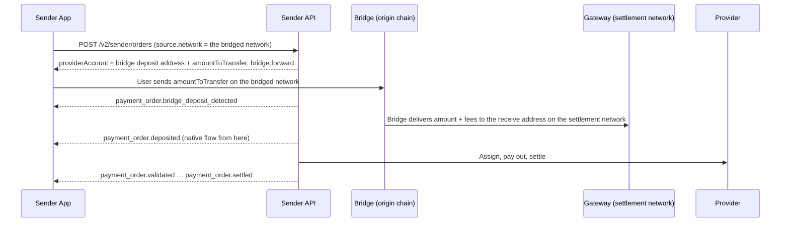
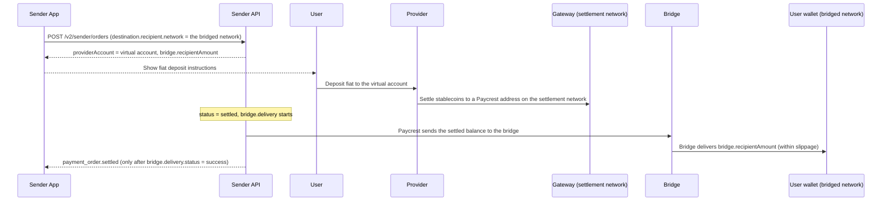

Paycrest settles orders on the networks where its Gateway contract runs (Base, Polygon, Arbitrum, BNB Smart Chain, …). A **bridged network** is a network Paycrest does not settle on but still accepts in `source.network` (off-ramp) and `destination.recipient.network` (on-ramp): the order itself lives on a native **settlement network**, and a cross-chain intent provider carries funds between the bridged network and the settlement network. Assignment, payout and settlement are exactly the native flow.

Tokens on bridged networks are listed by `GET /v2/tokens`, each direction is checked with the rates endpoint, and an order that uses one is described by a `bridge` object; off-ramp adds two webhook events, on-ramp adds none. The same leg fields describe an off-ramp deposit on a bridged network and an on-ramp delivery to one.

## Which networks are bridged

Paycrest never settles natively on a bridged network, so `GET /v2/tokens` lists a token there only while at least one bridge direction is live for it. A token with no live route, or every token on the network while bridging is switched off, is not listed. A listed row looks like any other token row; it does not say which directions work or where they settle:

```json
{
  "symbol": "USDC",
  "network": "solana",
  "contractAddress": "EPjFWdd5AufqSSqeM2qN1xzybapC8G4wEGGkZwyTDt1v",
  "decimals": 6
}
```

Routes are per **token and direction**. A bridged token has a separate off-ramp route and on-ramp route, each enabled on its own with no fallback to the other, because a bridge can support a swap one way and not the reverse. The two routes can settle on different networks: Solana USDC off-ramp could settle on Base while its on-ramp settles on Polygon. The examples on this page use Solana USDC settling on Base in both directions.

To check a direction before creating an order, ask for a quote on the bridged network:

- **Off-ramp:** `GET /v2/rates/solana/USDC/100/NGN?side=sell`
- **On-ramp:** `GET /v2/rates/solana/USDC/100/NGN?side=buy`

With `side`, a direction that has no route returns `404`; without `side`, that side is simply absent from the response. A quote that does come back is priced on that route's settlement network. Once an order exists, **`bridge.settlementNetwork`** on the order says where it settles, and it is the chain the order's `txHash` values are on.

The bridge route is selected by Paycrest. Integrators do not choose a carrier or depend on its identity; use the rate quote to check a direction and the order's `bridge` object to see where it settles and to track the hop.

Routes can be switched off per direction operationally; orders already created finish on the route they were created with. A create in a direction the token has no route for is refused with `400` "Provided token or payment rail is not supported" (field `Source` on off-ramp, `Destination` on on-ramp). A Solana token that is not bridged at all, or any Solana token while bridging is switched off, is refused with `400` "Solana is available only via POST /v2/sender/orders for tokens configured on a bridged network". Paycrest does not settle natively on Solana in either direction.

## Off-ramp on a bridged network

The user deposits on the bridged network; the bridge delivers the settlement-network amount to the order's receive address, and the native off-ramp flow takes over from there.



### Create the order

Use the normal off-ramp payload with the **origin chain** in `source.network` and a **refund address on that chain**:

```json
{
  "amount": "100",
  "source": {
    "type": "crypto",
    "currency": "USDC",
    "network": "solana",
    "refundAddress": "4Nd1mBQtrMJVYVfKf2PJy9NZUZdTAsp7D4xWLs4gDB4T"
  },
  "destination": {
    "type": "fiat",
    "currency": "NGN",
    "recipient": {
      "institution": "GTBINGLA",
      "accountIdentifier": "1234567890",
      "accountName": "John Doe",
      "memo": "Payment"
    }
  }
}
```

`amount`, `rate`, `senderFee`, provider pinning and everything else behave as on a native network. `amount` is still what settles on the settlement network; `amountIn: "fiat"` works too.

#### What comes back

```json
{
  "id": "550e8400-...",
  "status": "initiated",
  "amount": "100",
  "senderFee": "5",
  "transactionFee": "0.1",
  "providerAccount": {
    "network": "solana",
    "currency": "USDC",
    "receiveAddress": "7xKXtg2CW87d97TXJSDpbD5jBkheTqA83TZRuJosgAsU",
    "amountToTransfer": "105.36",
    "validUntil": "2026-09-22T10:30:00Z"
  },
  "source": { "type": "crypto", "currency": "USDC", "network": "solana", "refundAddress": "4Nd1…DB4T" },
  "destination": { "type": "fiat", "currency": "NGN", "recipient": { "..." : "..." } },
  "bridge": {
    "settlementNetwork": "base",
    "settlementCurrency": "USDC",
    "forward": {
      "status": "pending_deposit",
      "updatedAt": "2026-09-22T10:00:00Z"
    }
  }
}
```

Tell the user to send **exactly `providerAccount.amountToTransfer` of `providerAccount.currency` on `providerAccount.network` to `providerAccount.receiveAddress` before `validUntil`**, and to include `providerAccount.memo` whenever it is present (some chains share deposit addresses and need it).

<Warning>
  On a bridged network, `receiveAddress` is the **bridge's deposit address on the origin chain**, not a Paycrest address on the settlement network, and the amount to send is **`amountToTransfer`**, not `amount + senderFee + transactionFee`. `amountToTransfer` already includes the bridge fee; `amount + senderFee + transactionFee` is what arrives on the settlement network.
</Warning>

<Note>
  A deposit on a bridged network is an ordinary transfer on the origin chain, so the sender pays its gas: `amountToTransfer` covers the transfer itself and nothing else. Deposit addresses are per quote, so on Solana the sender also pays the one-off cost of creating the deposit address's token account — currently about **0.0015 SOL**, roughly 300× the signature fee a wallet quotes, and not refunded. A wallet holding the token but no native balance refuses before broadcast, with an error that does not mention Paycrest.
</Note>

### Track the bridge

<Warning>
  The order's `status` stays `initiated` while the bridge runs. Track `bridge.forward.status` for bridge progress; the order follows the [normal lifecycle](/concepts/transaction-lifecycle) only after delivery is credited on the settlement network.
</Warning>

| `bridge.forward.status` | Meaning | Order `status` |
|---|---|---|
| `pending_deposit` | Nothing seen at the deposit address yet | `initiated` |
| `known_deposit_tx` | The user's deposit tx is seen, awaiting confirmation. `originTxHash` is set. | `initiated` |
| `processing` | Deposit confirmed, transfer to the settlement network in flight | `initiated` |
| `success` | Delivered. `destinationTxHash` is the settlement-network tx; the order is credited from it. | `deposited` → … |
| `incomplete_deposit` | Deposit was below the quoted minimum; the bridge refunded it to `source.refundAddress`. `refundedAmount` is set. | `expired` |
| `refunded` | The bridge returned the deposit to `source.refundAddress` (`refundReason` says why) | `expired` |
| `expired` | The deposit window closed and nothing was deposited | `expired` |
| `failed` | Terminal without a known refund — Paycrest operations follow up | `expired` |

`providerAccount.amountToTransfer` is the **quote** — what the sender was told to send — and is never rewritten, so it still reads the same after the order settles. Once the bridge reports a deposit, `bridge.forward.depositedAmount` carries what actually arrived. Compare the two to see whether the user over- or underpaid; they can differ slightly in normal operation, since the bridge deducts its intake fee before the swap.

Two webhook events cover the hops. Neither changes `data.status`, so branch on `event`:

- **`payment_order.bridge_deposit_detected`** — the origin deposit was seen (`bridge.forward` moved to `known_deposit_tx`/`processing`). A good moment to tell the user "we've got it, bridging now".
- **`payment_order.bridge_refunded`** — a refund reached `source.refundAddress` on the origin chain (`bridge.reverse.status = success`).

Delivery itself is announced by the ordinary **`payment_order.deposited`** event, exactly like a direct deposit.

### Refunds

Refunds always go back to **`source.refundAddress` on the origin chain**. There are two paths:

- **Before delivery** (deposit too small, sent after the deadline, or the bridge could not route it): the bridge refunds the origin deposit directly. The order becomes `expired` and `bridge.forward` records `refundedAmount` / `refundReason`. No `bridge.reverse` is created.
- **After delivery** (the provider queue was exhausted or the order was refunded on the settlement network): the order becomes `refunded` as usual, and Paycrest then carries the settlement-network balance back with a **reverse hop**. `bridge.reverse` may include `depositAddress` while `bridge.forward` does not; otherwise the legs share the same tracking fields. When reverse reaches `success` you receive `payment_order.bridge_refunded` and `bridge.reverse.destinationTxHash` is the origin-chain tx.

<Info>
  `payment_order.refunded` means the refund reached the settlement network. `payment_order.bridge_refunded` means the reverse hop completed and the funds are back at `source.refundAddress` on the origin chain.
</Info>

Bridge fees are deducted from a refund; Paycrest never tops a refund up. Balances too small to bridge economically stay in Paycrest custody as `bridge.reverse.status = dust` and are handled by operations.

### Timing

- `providerAccount.validUntil` is the bridge's deposit window. Deposits after it are refunded by the bridge.
- The order stays creditable for a delivery grace period beyond the deadline, and Paycrest extends it further once a deposit is seen, so an on-time deposit is never expired mid-delivery. The usual "expired after `validUntil`" copy does not apply to bridged networks.
- Delivery typically completes within a few minutes of the deposit confirming.

### Errors

| Response | Cause | What to do |
|---|---|---|
| `400` `Network` — "Solana is available only via POST /v2/sender/orders for tokens configured on a bridged network" / "Unsupported network" | The Solana token is not bridged, or bridging is switched off (or the network is not bridged) | Offer a native network |
| `400` `Source` — "Provided token or payment rail is not supported" | The token has no off-ramp route (none configured, or switched off) | Check `GET /v2/rates/{network}/{token}/{amount}/{fiat}?side=sell` before creating; offer a native network |
| `400` `Source` — "Invalid … refund address" | `refundAddress` is not a valid address on the origin chain | Collect an origin-chain address |
| `503` "Bridge route unavailable" | No bridge quote could be obtained, or the quote could not deliver the exact amount | Retry shortly or offer a native network. Nothing was created. |

### Explorer links

`source.network` is the origin chain; the order's `txHash` and `bridge.forward.destinationTxHash` are on **`bridge.settlementNetwork`**. Link `bridge.forward.originTxHash` and `bridge.reverse.destinationTxHash` to the origin-chain explorer and everything else to the settlement-network explorer.

## On-ramp on a bridged network

The user pays fiat exactly as on a native network. The provider settles the stablecoins on the settlement network through the Gateway, onto an address Paycrest controls; Paycrest then bridges them to the user's address on the bridged network with a **delivery** hop. Before settlement, the order is an ordinary on-ramp order on the settlement network.



### Create the order

Use the normal on-ramp payload with the **bridged network** in `destination.recipient.network` and the user's address on that network:

```json
{
  "amount": "100",
  "amountIn": "crypto",
  "source": {
    "type": "fiat",
    "currency": "NGN",
    "refundAccount": {
      "institution": "GTBINGLA",
      "accountIdentifier": "1234567890",
      "accountName": "John Doe"
    }
  },
  "destination": {
    "type": "crypto",
    "currency": "USDC",
    "recipient": {
      "address": "4Nd1mBQtrMJVYVfKf2PJy9NZUZdTAsp7D4xWLs4gDB4T",
      "network": "solana"
    }
  }
}
```

A destination on a bridged network is accepted only for tokens with a live **on-ramp** route; check with `GET /v2/rates/solana/USDC/100/NGN?side=buy` first. The on-ramp route can settle on a different network from the same token's off-ramp route, so read `bridge.settlementNetwork` from the order rather than assuming. On Solana, the user's wallet must already have a token account for the stablecoin's mint; Paycrest checks this at create and refuses the order otherwise.

`rate`, `senderFee`, provider pinning and everything else behave as on a native network, priced on the on-ramp route's settlement network.

#### Two amounts

The order carries two crypto amounts, because the bridge costs something:

- **`amount`** is the **settlement-side** amount: what the provider settles on the settlement network and what the sender pays for in fiat. Fees, the fiat total and `providerAccount.amountToTransfer` are all computed from it.
- **`bridge.recipientAmount`** is what the user **receives** on the bridged network, as quoted at create.

How they relate depends on `amountIn`:

| `amountIn` | You set | `amount` in the response | `bridge.recipientAmount` |
|---|---|---|---|
| `crypto` (default) | What the user should receive | Slightly **higher** than requested — the bridge cost is priced into the fiat the sender pays | The requested amount. The user receives it within a small slippage. |
| `fiat` | What the user pays | `fiat ÷ rate`, as on a native network | Slightly **lower** than `amount` — the bridge cost comes out of the stablecoins |

Show the user `bridge.recipientAmount` as what they will receive, not `amount`. Paycrest never tops up a delivery. Once delivery completes, `bridge.delivery.amountOut` carries what actually arrived.

#### What comes back

```json
{
  "id": "550e8400-...",
  "status": "initiated",
  "amount": "100.05",
  "rate": "1650",
  "providerAccount": {
    "institution": "Guaranty Trust Bank",
    "accountIdentifier": "0123456789",
    "accountName": "Provider A / John Doe",
    "amountToTransfer": "165082.5",
    "currency": "NGN",
    "validUntil": "2026-09-26T10:30:00Z"
  },
  "source": { "type": "fiat", "currency": "NGN", "refundAccount": { "..." : "..." } },
  "destination": {
    "type": "crypto",
    "currency": "USDC",
    "recipient": { "address": "4Nd1mBQtrMJVYVfKf2PJy9NZUZdTAsp7D4xWLs4gDB4T", "network": "solana" }
  },
  "bridge": {
    "settlementNetwork": "base",
    "settlementCurrency": "USDC",
    "recipientAmount": "100"
  }
}
```

`destination` always echoes the user's address and bridged network; the Paycrest address that receives the settlement is never exposed. `bridge.delivery` is absent until the delivery starts, and `bridge.forward` / `bridge.reverse` are never set on on-ramp orders. Present `providerAccount` to the user exactly as for a native on-ramp.

### Track the delivery

<Warning>
  On a bridged network, `status: "settled"` means the stablecoins settled on the **settlement network**, not that the user has them. The **`payment_order.settled`** webhook is held back until `bridge.delivery.status` is `success`, so crediting the user on the webhook is safe. If you poll instead, treat the order as complete only when `status` is `settled` **and** `bridge.delivery.status` is `success`.
</Warning>

| `bridge.delivery.status` | Meaning | Order `status` |
|---|---|---|
| *(absent)* | Delivery has not started: the order has not settled yet, or settled moments ago | `initiated` … `settled` |
| `pending_deposit` | Paycrest is sending the settled balance to the bridge | `settled` |
| `known_deposit_tx` | Paycrest's transfer to the bridge is seen, awaiting confirmation. `originTxHash` is set (settlement network). | `settled` |
| `processing` | Transfer to the bridged network in flight | `settled` |
| `success` | Delivered. `destinationTxHash` is the tx on the bridged network and `amountOut` is what arrived. `payment_order.settled` is sent now. | `settled` |
| `incomplete_deposit` / `refunded` | The bridge returned the funds to Paycrest on the settlement network (`refundedAmount`, `refundReason`). Paycrest retries automatically; a new `bridge.delivery` replaces this one. | `settled` |
| `failed` / `expired` | Terminal without delivery. The funds stay in Paycrest custody; Paycrest operations follow up. | `settled` |
| `dust` | The balance is too small to bridge and stays in Paycrest custody; operations follow up. | `settled` |

No webhook event is added for delivery. Everything before settlement — `payment_order.pending`, `payment_order.expired`, fiat refunds to `source.refundAccount` — is the native on-ramp flow.

### Refunds

Fiat refunds work as on a native on-ramp: they happen only before the order settles, and go to `source.refundAccount`. Once the order is `settled` the provider has released the stablecoins, so the order is **never refunded in fiat**; a delivery the bridge returns is retried by Paycrest until it reaches the user's address.

### Timing

- `providerAccount.validUntil` is the fiat deposit window, as on a native on-ramp.
- Delivery starts within a few minutes of settlement and typically completes a few minutes later. `payment_order.settled` arrives correspondingly later than on a native on-ramp.

### Errors

| Response | Cause | What to do |
|---|---|---|
| `400` `Destination` — "Solana is available only via POST /v2/sender/orders for tokens configured on a bridged network" | The Solana token is not bridged at all, or bridging is switched off | Offer a native network |
| `400` `Destination` — "Provided token or payment rail is not supported" | The token has no on-ramp route (none configured, or switched off), even if it has an off-ramp route | Check `GET /v2/rates/{network}/{token}/{amount}/{fiat}?side=buy` before creating; offer a native network |
| `400` `Destination` — "Invalid Solana recipient address" | `destination.recipient.address` is not a Solana public key | Collect a Solana address |
| `400` `Destination` — "recipient … token account does not exist …" | The user's wallet has no token account for the stablecoin's mint | Ask the user to create the token account for that mint, then retry |
| `400` `Amount` — "Amount is below the minimum of 1 for delivery to a bridged network" | The requested or settlement amount is under the bridge minimum (1 unit of the stablecoin) | Raise the amount |
| `503` "Bridge route unavailable" | No bridge quote could be obtained for the amount, or the bridge's price for the route was outside the range Paycrest accepts (a broken route, not a normal fee) | Retry shortly or offer a native network. Nothing was created. |

### Explorer links

`destination.recipient.network` is the bridged network; the order's `txHash` and `bridge.delivery.originTxHash` are on **`bridge.settlementNetwork`**. Link `bridge.delivery.destinationTxHash` to the bridged network's explorer and everything else to the settlement-network explorer.
