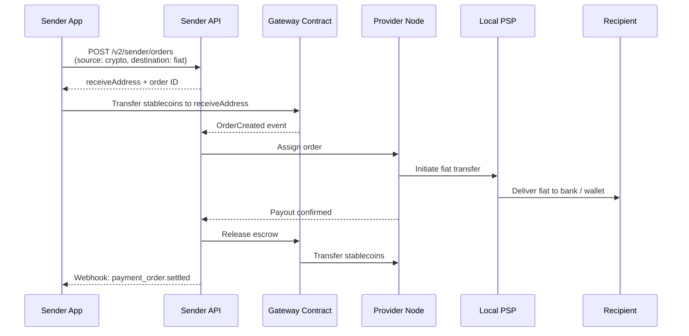
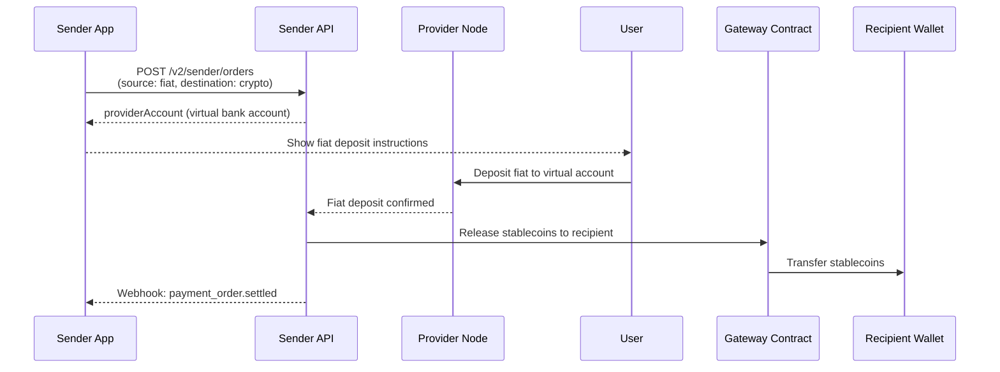

The Sender API lets your app create payment orders in two directions:

- **Offramp** — user sends stablecoins, recipient receives local fiat (bank or mobile wallet)
- **Onramp** — user deposits fiat into a virtual account, recipient receives stablecoins

Both flows go through the same endpoint: `POST /v2/sender/orders`. The direction is determined by the `source` and `destination` object types you pass.

## Flow Overview

<Tabs>
  <Tab title="Offramp (Stablecoin → Fiat)">

  </Tab>
  <Tab title="Onramp (Fiat → Stablecoin)">

  </Tab>
</Tabs>

## Getting Started

### 1. Obtain API Credentials

Sign up as a **Sender** at [app.paycrest.io](https://app.paycrest.io) and complete the KYB process. Once verified, you'll have:

- **API Key** — included in every request as the `API-Key` header
- **API Secret** — used to verify webhook signatures; keep this secret

```javascript
const headers = {
  "API-Key": "YOUR_API_KEY",
  "Content-Type": "application/json"
};
```

### 2. Configure Tokens (Optional)

In the dashboard settings, you can set a default `refundAddress` and `feeAddress` per token/network. These can also be passed per-request via `source.refundAddress`.

---

## Step 1: Verify the Recipient Account

Before creating an order, verify the recipient's bank or mobile account. This reduces failed orders.

```bash
curl -X POST "https://api.paycrest.io/v1/verify-account" \
  -H "API-Key: YOUR_API_KEY" \
  -H "Content-Type: application/json" \
  -d '{
    "institution": "GTBINGLA",
    "accountIdentifier": "1234567890",
    "currency": "NGN"
  }'
```

A `200 OK` response returns the resolved `accountName` in the `data` field. If `data` is an actual name (e.g. `"JOHN DOE"`), use that exact value as `accountName` in your order. If `data` is `"OK"`, account name lookup is not available for that corridor — pass your own `accountName` value instead.

---

## Step 2: Fetch a Rate

The rates endpoint is public (no API key required). Always fetch a fresh rate immediately before creating an order.

<Tabs>
  <Tab title="cURL">
```bash
curl "https://api.paycrest.io/v1/rates/USDT/100/NGN?network=base"
```
  </Tab>
  <Tab title="JavaScript">
```javascript
const rate = await fetch("https://api.paycrest.io/v1/rates/USDT/100/NGN?network=base")
  .then(r => r.json())
  .then(r => r.data); // e.g. "1500.50"
```
  </Tab>
  <Tab title="Python">
```python
import requests
res = requests.get("https://api.paycrest.io/v1/rates/USDT/100/NGN", params={"network": "base"})
rate = res.json()["data"]  # e.g. "1500.50"
```
  </Tab>
</Tabs>

---

## Step 3: Create an Order

`POST /v2/sender/orders`

Pass a `source` and `destination` object. The `type` field on each determines the direction.

<Tabs>
  <Tab title="Offramp (stablecoin → fiat)">

User sends stablecoins; recipient receives fiat. Set `source.type = "crypto"` and `destination.type = "fiat"`.

```bash
curl -X POST "https://api.paycrest.io/v2/sender/orders" \
  -H "API-Key: YOUR_API_KEY" \
  -H "Content-Type: application/json" \
  -d '{
    "amount": "100",
    "source": {
      "type": "crypto",
      "currency": "USDT",
      "network": "base",
      "refundAddress": "0xYourWalletAddress"
    },
    "destination": {
      "type": "fiat",
      "currency": "NGN",
      "recipient": {
        "institution": "GTBINGLA",
        "accountIdentifier": "1234567890",
        "accountName": "John Doe",
        "memo": "Salary payment"
      }
    },
    "reference": "order-001"
  }'
```
  </Tab>
  <Tab title="Onramp (fiat → stablecoin)">

User deposits fiat; recipient receives stablecoins. Set `source.type = "fiat"` and `destination.type = "crypto"`.

```bash
curl -X POST "https://api.paycrest.io/v2/sender/orders" \
  -H "API-Key: YOUR_API_KEY" \
  -H "Content-Type: application/json" \
  -d '{
    "amount": "50000",
    "amountIn": "fiat",
    "source": {
      "type": "fiat",
      "currency": "NGN",
      "refundAccount": {
        "institution": "GTBINGLA",
        "accountIdentifier": "1234567890",
        "accountName": "John Doe"
      }
    },
    "destination": {
      "type": "crypto",
      "currency": "USDT",
      "network": "base",
      "recipient": {
        "address": "0xRecipientWalletAddress",
        "network": "base"
      }
    },
    "reference": "order-002"
  }'
```

  </Tab>
  <Tab title="JavaScript (offramp)">
```javascript
const res = await fetch("https://api.paycrest.io/v2/sender/orders", {
  method: "POST",
  headers: { "API-Key": "YOUR_API_KEY", "Content-Type": "application/json" },
  body: JSON.stringify({
    amount: "100",
    source: {
      type: "crypto",
      currency: "USDT",
      network: "base",
      refundAddress: "0xYourWalletAddress"
    },
    destination: {
      type: "fiat",
      currency: "NGN",
      recipient: {
        institution: "GTBINGLA",
        accountIdentifier: "1234567890",
        accountName: "John Doe",
        memo: "Salary payment"
      }
    },
    reference: "order-001"
  })
});
const order = await res.json();
```
  </Tab>
  <Tab title="Python (offramp)">
```python
import requests

order = requests.post(
    "https://api.paycrest.io/v2/sender/orders",
    headers={"API-Key": "YOUR_API_KEY", "Content-Type": "application/json"},
    json={
        "amount": "100",
        "source": {
            "type": "crypto",
            "currency": "USDT",
            "network": "base",
            "refundAddress": "0xYourWalletAddress"
        },
        "destination": {
            "type": "fiat",
            "currency": "NGN",
            "recipient": {
                "institution": "GTBINGLA",
                "accountIdentifier": "1234567890",
                "accountName": "John Doe",
                "memo": "Salary payment"
            }
        },
        "reference": "order-001"
    }
).json()
```
  </Tab>
</Tabs>

### Request Fields

| Field | Type | Required | Description |
|-------|------|----------|-------------|
| `amount` | string | ✅ | Payment amount. Denomination set by `amountIn` (defaults to crypto units). |
| `amountIn` | string | — | `"crypto"` (default) or `"fiat"`. Set to `"fiat"` when `amount` is in the fiat currency. |
| `rate` | string | — | Exchange rate (fiat per crypto). Omit to use the best available rate. |
| `senderFeePercent` | string | — | Optional fee percentage you collect, settled atomically onchain. |
| `reference` | string | — | Your internal order ID. |
| `source` | object | ✅ | `{ type: "crypto", ... }` for offramp; `{ type: "fiat", ... }` for onramp. |
| `destination` | object | ✅ | `{ type: "fiat", ... }` for offramp; `{ type: "crypto", ... }` for onramp. |

---

## Step 4: Handle the Provider Account Response

The create response includes a `providerAccount` that differs by direction.

### Offramp — send tokens to `receiveAddress`

```json
{
  "id": "550e8400-...",
  "status": "initiated",
  "providerAccount": {
    "network": "base",
    "receiveAddress": "0xProviderReceiveAddress",
    "validUntil": "2026-03-01T10:05:00Z"
  },
  "source": { "type": "crypto", "currency": "USDT", "network": "base" },
  "destination": { "type": "fiat", "currency": "NGN", "recipient": { ... } }
}
```

Send **exactly** `amount + senderFee + transactionFee` (all returned in the response) in the specified token to `providerAccount.receiveAddress` before `validUntil`.

<Warning>
  Always use `decimals` from [GET /tokens](/api-reference/general/list-supported-tokens) to compute the token amount — do not hardcode. BNB Smart Chain USDT and USDC use 18 decimals; all other chains use 6.
</Warning>

<Tabs>
  <Tab title="JavaScript (viem)">
```javascript
import { parseUnits } from 'viem';

// Fetch token decimals from GET /v2/tokens or use known value
const tokenDecimals = 6; // USDT on Base; confirm via /v2/tokens

const totalAmount = parseUnits(
  (parseFloat(order.amount) + parseFloat(order.senderFee) + parseFloat(order.transactionFee)).toString(),
  tokenDecimals
);

const hash = await walletClient.writeContract({
  address: '0xfde4C96c8593536E31F229EA8f37b2ADa2699bb2', // USDT on Base
  abi: ERC20_ABI,
  functionName: 'transfer',
  args: [order.providerAccount.receiveAddress, totalAmount]
});
```
  </Tab>
  <Tab title="Python (web3.py)">
```python
from web3 import Web3

# USDT on Base; fetch decimals from GET /v2/tokens
USDT_ADDRESS = '0xfde4C96c8593536E31F229EA8f37b2ADa2699bb2'
token_decimals = 6

total_amount = int(
    (float(order['amount']) + float(order['senderFee']) + float(order['transactionFee']))
    * 10**token_decimals
)

tx = usdt_contract.functions.transfer(
    order['providerAccount']['receiveAddress'],
    total_amount
).build_transaction({ ... })
```
  </Tab>
</Tabs>

### Onramp — present virtual account to user

```json
{
  "id": "550e8400-...",
  "status": "initiated",
  "providerAccount": {
    "institution": "GTBINGLA",
    "accountIdentifier": "0123456789",
    "accountName": "Paycrest / John Doe",
    "amountToTransfer": "50000",
    "currency": "NGN",
    "validUntil": "2026-03-01T10:05:00Z"
  },
  "source": { "type": "fiat", "currency": "NGN" },
  "destination": { "type": "crypto", "currency": "USDT", "recipient": { ... } }
}
```

Display the `providerAccount` details to your user. They must transfer exactly `amountToTransfer` in `currency` to `accountIdentifier` before `validUntil`.

---

## Step 5: Monitor Order Status

Listen for webhooks or poll `GET /v2/sender/orders/:id`.

### Webhook Events

Configure your webhook URL in the [Sender Dashboard](https://app.paycrest.io). Webhooks use the `payment_order.<status>` format and include a `direction` field (`"offramp"` or `"onramp"`):

```json
{
  "event": "payment_order.settled",
  "webhookVersion": "2",
  "data": {
    "id": "550e8400-...",
    "direction": "offramp",
    "status": "settled",
    "amount": "100",
    "txHash": "0x...",
    ...
  }
}
```

| Event | When it fires |
|-------|--------------|
| `payment_order.deposited` | Stablecoin deposit detected (offramp) |
| `payment_order.pending` | Assigned to provider / fiat deposit confirmed (onramp) |
| `payment_order.validated` | Fiat payout confirmed by provider |
| `payment_order.settling` | Onchain release in progress |
| `payment_order.settled` | Order complete |
| `payment_order.refunding` | Refund in progress |
| `payment_order.refunded` | Funds returned to sender |
| `payment_order.expired` | No deposit received before `validUntil` |

<Note>
  You can notify the user of a successful offramp at `payment_order.validated` — that's when the provider has confirmed fiat delivery. For onramp, use `payment_order.settled` — that's when stablecoins are confirmed on-chain.
</Note>

### Verify Webhook Signatures

Verify the `X-Paycrest-Signature` header using HMAC-SHA256 with your API Secret:

<Tabs>
  <Tab title="JavaScript">
```javascript
const crypto = require('crypto');

function verifyWebhook(rawBody, signature, secret) {
  const computed = crypto
    .createHmac('sha256', secret)
    .update(rawBody)
    .digest('hex');
  return crypto.timingSafeEqual(Buffer.from(computed), Buffer.from(signature));
}

app.post('/webhook', express.raw({ type: 'application/json' }), (req, res) => {
  const sig = req.headers['x-paycrest-signature'];
  if (!verifyWebhook(req.body, sig, process.env.API_SECRET)) {
    return res.status(401).send('Invalid signature');
  }
  const { event, data } = JSON.parse(req.body);
  // handle event...
  res.sendStatus(200);
});
```
  </Tab>
  <Tab title="Python">
```python
import hmac, hashlib

def verify_webhook(raw_body: bytes, signature: str, secret: str) -> bool:
    computed = hmac.new(secret.encode(), raw_body, hashlib.sha256).hexdigest()
    return hmac.compare_digest(computed, signature)

@app.route('/webhook', methods=['POST'])
def webhook():
    sig = request.headers.get('X-Paycrest-Signature')
    if not verify_webhook(request.data, sig, os.getenv('API_SECRET')):
        return 'Invalid signature', 401
    payload = request.json
    # handle payload['event'] ...
    return '', 200
```
  </Tab>
  <Tab title="Go">
```go
import (
    "crypto/hmac"
    "crypto/sha256"
    "encoding/hex"
    "io"
    "net/http"
)

func verifyWebhook(body []byte, signature, secret string) bool {
    mac := hmac.New(sha256.New, []byte(secret))
    mac.Write(body)
    return hmac.Equal([]byte(hex.EncodeToString(mac.Sum(nil))), []byte(signature))
}

func webhookHandler(w http.ResponseWriter, r *http.Request) {
    body, _ := io.ReadAll(r.Body)
    sig := r.Header.Get("X-Paycrest-Signature")
    if !verifyWebhook(body, sig, os.Getenv("API_SECRET")) {
        http.Error(w, "Invalid signature", http.StatusUnauthorized)
        return
    }
    // handle body...
}
```
  </Tab>
</Tabs>

### Polling

```javascript
async function getOrderStatus(orderId) {
  const { data } = await fetch(`https://api.paycrest.io/v2/sender/orders/${orderId}`, {
    headers: { "API-Key": "YOUR_API_KEY" }
  }).then(r => r.json());

  switch (data.status) {
    case 'validated': // offramp: fiat delivered — safe to notify user
    case 'settled':   // onramp: stablecoins delivered — or offramp fully on-chain
    case 'refunded':  // funds returned
    case 'expired':   // no deposit received
  }
  return data;
}
```

---

## Sender Fees

You can optionally charge your users a fee on each order. It's settled atomically onchain — no off-chain billing required. Configure your fee in [Sender Dashboard](https://app.paycrest.io) settings (required). You can override it per-request by passing `senderFeePercent` in the order payload.

```json
{
  "amount": "100",
  "senderFeePercent": "0.5",
  ...
}
```

The total the user sends to the `providerAccount` is `amount + senderFee + transactionFee`, all returned in the create response.

---

## Testing

Paycrest runs on mainnet only. Test with the minimum order size: **$0.50 on any supported chain**. Use small amounts until you've verified your integration end-to-end.

---

## v1 Legacy API

The v1 API is fully supported for existing integrations. It supports **offramp only** and uses a flat request schema.

<AccordionGroup>
  <Accordion title="v1 Offramp — Create Order">

`POST /v1/sender/orders`

```json
{
  "amount": 100,
  "token": "USDT",
  "network": "base",
  "rate": "1500.50",
  "recipient": {
    "institution": "GTBINGLA",
    "accountIdentifier": "1234567890",
    "accountName": "John Doe",
    "currency": "NGN",
    "memo": "Payment"
  },
  "reference": "order-001",
  "returnAddress": "0xYourWalletAddress"
}
```

The response includes `receiveAddress` (string) and `validUntil`. Send tokens to `receiveAddress`.

  </Accordion>
  <Accordion title="v1 vs v2 Differences">

| Feature | v1 | v2 |
|---------|----|----|
| Offramp | ✅ | ✅ |
| Onramp | ❌ | ✅ |
| Schema | Flat: `token`, `network`, `recipient` | Polymorphic: `source`, `destination` with `type` |
| `refundAddress` | `returnAddress` (top-level) | `source.refundAddress` |
| Amount direction | Always crypto | `amountIn: "fiat"` or `"crypto"` |
| Sender fee | Fixed via dashboard | Dashboard (fixed) **or** `senderFeePercent` on request |
| Numeric types | Number | String |
| Webhook version | `"1"` | `"2"` |

  </Accordion>
</AccordionGroup>

---

## Related

- [Transaction Lifecycle](/concepts/transaction-lifecycle) — order statuses, webhook events, expired vs refunded
- [Supported Stablecoins](/resources/supported-stablecoins) — tokens, networks, contract addresses
- [Supported Currencies](/resources/supported-currencies) — active fiat corridors
- [API Reference — Sender](/api-reference/sender/initiate-payment-order-v2) — full endpoint spec
